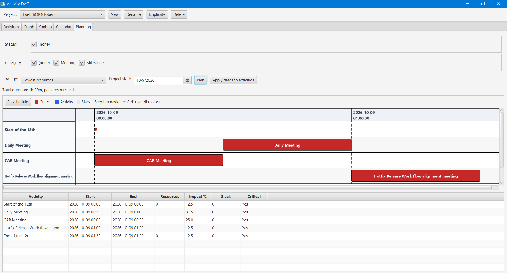
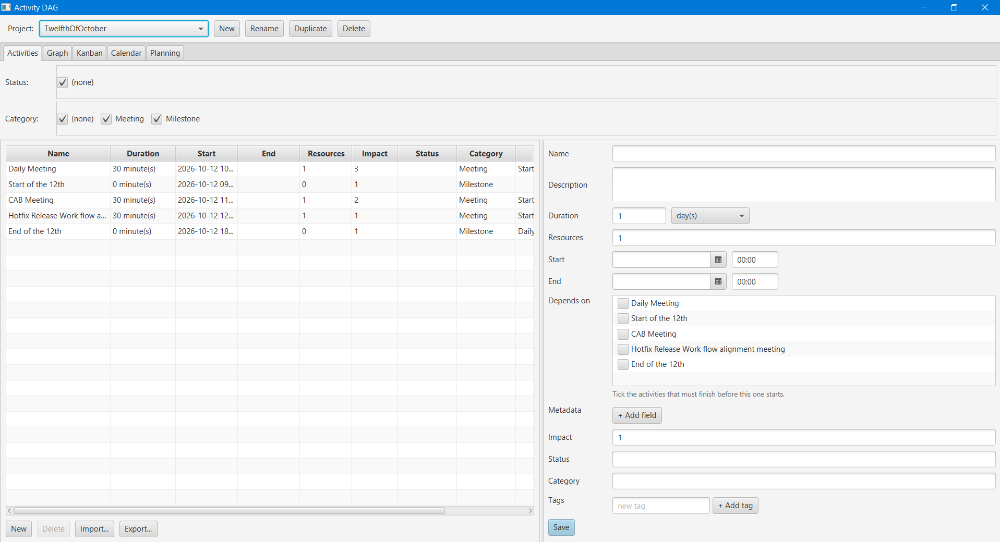
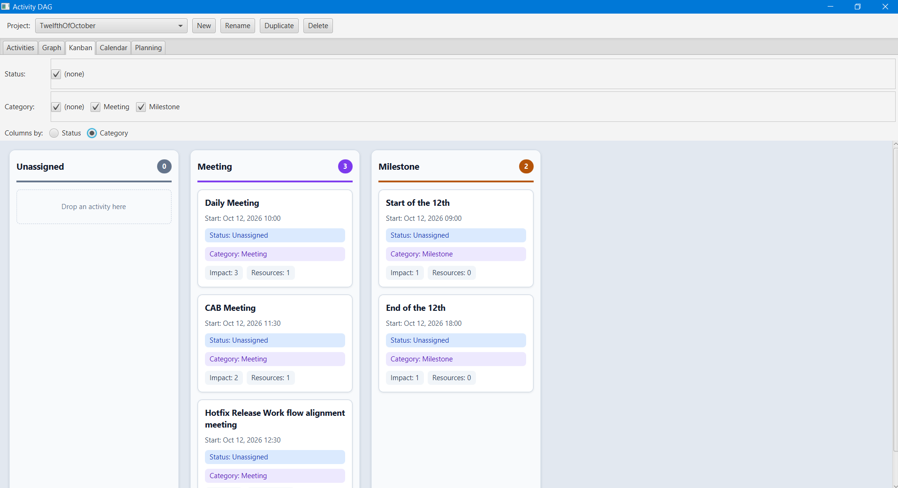
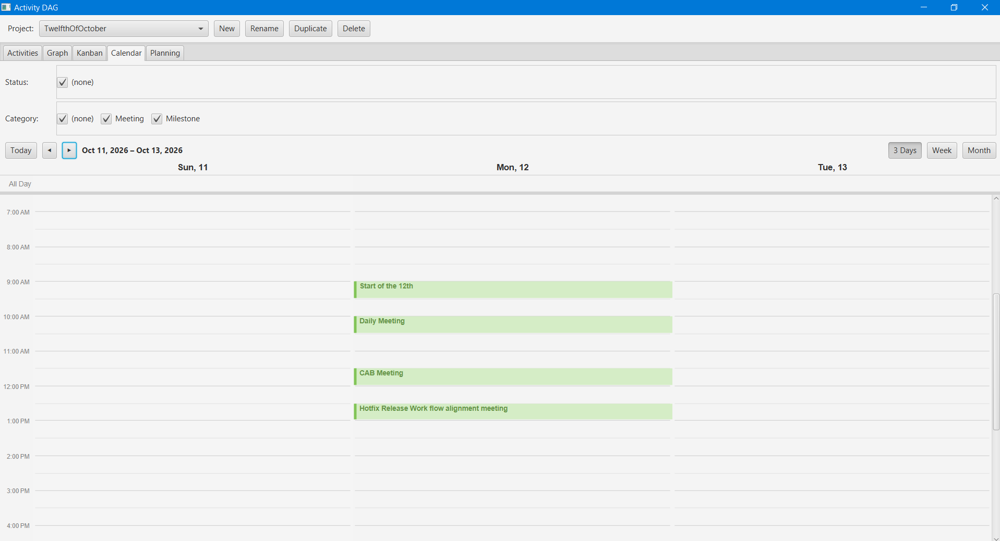

# Activity DAG

A JavaFX desktop application for planning dependency-driven work. Define activities as a directed acyclic graph (DAG), organize them on a Kanban board, manage dates in a calendar, and compare schedules based on critical paths, resources and impact.



## Getting started

### Windows portable application

Download `activity-dag-<version>-Windows-portable.zip` from [Releases](https://github.com/TalaatHarb/activity-dag/releases), extract the entire ZIP, and run `ActivityDag\ActivityDag.exe`.

**No Java installation is required.** Keep the accompanying `app` and `runtime` folders next to the executable.

### Run from source

Requires **JDK 17 or later** and **Maven**.

```shell
git clone https://github.com/TalaatHarb/activity-dag.git
cd activity-dag
mvn javafx:run
```

To build and run the tests:

```shell
mvn verify
```

## Explore the application

### Activities: define your work

Create and edit activities with descriptions, resources, impact, status, category, tags and key/value metadata. Set durations in **minutes, hours, days or weeks**, and enter start/end dates with local times.

Dependencies are selected with checkboxes. The activity itself and activities that depend on it are excluded to prevent cycles. Deleting an activity that others depend on shows a warning before removing those dependency references.



### Kanban: organize and prioritize

Group activities into columns by **status or category**, then drag cards between columns to update that field. Cards show start date, status, category, impact, resources and tags when assigned.

Cards are ordered by **earliest start date first**, with unscheduled work last and ties ordered by name. Accented headers, activity counts and highlighted drop targets keep columns easy to distinguish.



### Calendar: manage scheduled work

View activities in **3-day, week or month** layouts powered by [CalendarFX](https://github.com/dlsc-software-consulting-gmbh/CalendarFX). The 3-day view starts with yesterday, today and tomorrow and moves one day at a time.

Use the **scrollable Projects checklist on the left** to overlay activities from multiple projects, each with its own calendar color. Only the current project is selected initially; switching the project in the top bar resets this selection. You can select any combination, or deselect all projects. Status/category filters apply to all selected projects, and the calendar's filter choices include their values.

Drag activities to move them, or resize their edges to change start/end times. Only activities with a start or end date appear in the calendar.

Timing edits save to the activity's original project, even when it is not selected in the top bar. Other tabs continue to show only the current project's activities.



### Planning: compare scheduling strategies

Choose a project start date and a strategy, then click **Plan** to calculate a schedule:

| Strategy | Scheduling approach |
|---|---|
| Critical Path Method (CPM) | Start activities as soon as dependencies finish and identify the critical path and slack. |
| Lowest resources | Level resources using a cap based on the largest individual activity requirement, trading time for lower peak usage. |
| Maximum resources | Assume unlimited resources and start all ready activities immediately for the shortest schedule. |
| High impact first | Prioritize high-impact work and its prerequisites when resource capacity is limited. |

The Gantt view uses [Timeline](https://github.com/dariol83/timeline) **0.9.1**. Critical activities are red, slack is shaded grey, and zero-duration milestones appear as circles. Hover over tasks for details, scroll to navigate, use **Ctrl + scroll** to zoom, or click **Fit schedule** to see the full plan.

The result table shows start/end times, resources, impact percentage, slack and critical-path membership. **Apply dates to activities** saves the calculated schedule back to your tasks.

Planning uses minute precision and **continuous calendar time: one day is 24 hours**, not a working-day calendar.

### Graph: inspect dependencies

The **Graph** tab displays the current project's activities and their dependency connections as a DAG.

## Projects, filters and data exchange

### Projects and shared filters

Create, rename, switch between or delete projects using the top bar. **Duplicate** creates a named copy of the current project, with fresh project/task IDs and dependencies remapped to the copied tasks.

Status/category filters are shared across tabs. Checkbox states stay synchronized, Kanban and Calendar update immediately, and an existing Gantt plan recalculates for the visible activities. Editing activities clears the plan so it can be regenerated.

### JSON import and export

Use **Export...** in the Activities tab to save the current project's activities to a JSON array file. Use **Import...** to add activities from a file to the selected project with fresh IDs; existing activities are not replaced.

IDs are omitted from the file. Dependencies use activity names, such as `"dependsOn": ["Design"]`, so names must be unique within an exported project or imported file. Imported dependencies resolve only to activities in that file, not to existing tasks with matching names.

The entire import is validated before saving, including unknown dependencies, cycles and invalid values.

### Local storage

Projects and activities are stored locally in a MapDB file at:

```text
~/.activity-dag/activity-dag.db
```

The path can be overridden with the JVM property `-Dactivitydag.db=<path>`.

## Technology

| Component | Library |
|---|---|
| Desktop UI | JavaFX + FXML (MVC) |
| Calendar | CalendarFX |
| Gantt timeline | Timeline 0.9.1 |
| Dependency injection | Guice |
| Local persistence | MapDB |
| Model/DTO mapping | MapStruct |
| JSON import/export | Jackson |

## Release builds

Pushing a `v*` tag builds OS-specific JARs for **Linux, Windows and macOS** and attaches them to a GitHub release. Windows releases also include the portable application with a bundled Java runtime described above.
